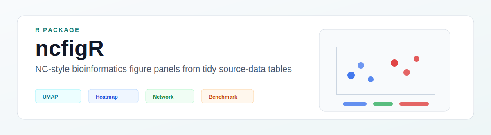

<p align="center">
  
</p>

# ncfigR

`ncfigR` is a small R package for drawing common bioinformatics figure panels from tidy source-data tables.

The package is meant for the stage after analysis, when UMAP coordinates, cell-type proportions, marker values, ligand-receptor tables, trajectory summaries, or benchmark metrics have already been exported and need to be turned into consistent manuscript figures. It does not run a single-cell or spatial analysis pipeline, and it does not replace Seurat, Scanpy, CellChat, or similar tools.

## What it is useful for

- Drawing embedding, composition, marker heatmap, ligand-receptor, trajectory, and benchmark panels from plain tables.
- Keeping colors, themes, legends, and panel spacing consistent across a figure.
- Combining ggplot panels with `patchwork`.
- Exporting the same figure as PDF, SVG, and PNG.
- Keeping plotted data close to auditable source tables instead of hidden inside large analysis objects.

## Installation

```r
install.packages("remotes")
remotes::install_github("jiangcongxin/ncfigR")
```

## Example

```r
library(ncfigR)
library(readr)

embedding <- read_tsv(
  system.file("extdata/embedding.tsv", package = "ncfigR"),
  show_col_types = FALSE
)

composition <- read_tsv(
  system.file("extdata/composition.tsv", package = "ncfigR"),
  show_col_types = FALSE
)

p1 <- plot_embedding_panel(
  embedding,
  color_col = "cell_type",
  label = TRUE,
  title = "Cell states"
)

p2 <- plot_composition_panel(
  composition,
  group_col = "group",
  category_col = "cell_type",
  value_col = "proportion",
  title = "Cell composition"
)

fig <- compose_nc_figure(list(p1, p2), ncol = 2)

export_figure_bundle(fig, "example_figure", out_dir = "figures/exports")
```

## Functions

| Function | Purpose |
|---|---|
| `plot_embedding_panel()` | UMAP or other 2D embedding scatter plot |
| `plot_composition_panel()` | Cell composition bar plot |
| `plot_marker_heatmap()` | Marker heatmap from a feature-by-group table |
| `plot_lr_heatmap()` | Ligand-receptor heatmap |
| `plot_lr_network()` | Small ligand-receptor network panel |
| `plot_trajectory_trend()` | Pseudotime or trajectory trend plot |
| `plot_benchmark_heatmap()` | Method benchmark heatmap |
| `compose_nc_figure()` | Combine panels into one figure |
| `export_figure_bundle()` | Export PDF, SVG, PNG, and optional source manifest |

## Input data

The package uses tidy tables. Toy files are included for testing and examples:

```r
system.file("extdata", package = "ncfigR")
```

For real projects, export the result you want to plot into the same kind of table, check the column names, and pass it to the corresponding plotting function.

## License

MIT License.
